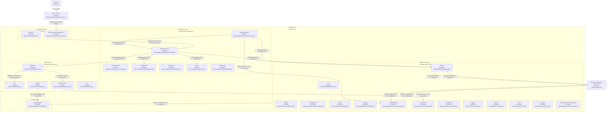

# Unnamed CodeViz Diagram

```mermaid
graph TD

    customer["Customer<br>[External]"]
    wooCommerceExt["WooCommerce<br>/sii-boleta-dte/src/Infrastructure/WooCommerce"]
    siiExt["Servicio de Impuestos Internos (SII)<br>/sii-boleta-dte/resources/wsdl"]
    subgraph siiBoletaDte["SII Boleta DTE<br>/sii-boleta-dte"]
        subgraph presentation["Presentation Layer<br>/sii-boleta-dte/src/Presentation"]
            adminUI["Admin UI<br>/sii-boleta-dte/src/Presentation/Admin"]
            wooCommerceIntegrationUI["WooCommerce Integration UI<br>/sii-boleta-dte/src/Presentation/WooCommerce"]
        end
        subgraph application["Application Layer<br>/sii-boleta-dte/src/Application"]
            consumoFolios["ConsumoFolios<br>/sii-boleta-dte/src/Application/ConsumoFolios.php"]
            emitirDteService["EmitirDteService<br>/sii-boleta-dte/src/Application/EmitirDteService.php"]
            folioManager["FolioManager<br>/sii-boleta-dte/src/Application/FolioManager.php"]
            libroBoletas["LibroBoletas<br>/sii-boleta-dte/src/Application/LibroBoletas.php"]
            queue["Queue<br>/sii-boleta-dte/src/Application/Queue.php"]
            queueProcessor["QueueProcessor<br>/sii-boleta-dte/src/Application/QueueProcessor.php"]
            rvdManager["RvdManager<br>/sii-boleta-dte/src/Application/RvdManager.php"]
            %% Edges at this level (grouped by source)
            emitirDteService["EmitirDteService<br>/sii-boleta-dte/src/Application/EmitirDteService.php"] -->|"Manages folios | PHP Function Call"| folioManager["FolioManager<br>/sii-boleta-dte/src/Application/FolioManager.php"]
            emitirDteService["EmitirDteService<br>/sii-boleta-dte/src/Application/EmitirDteService.php"] -->|"Adds to queue | PHP Function Call"| queue["Queue<br>/sii-boleta-dte/src/Application/Queue.php"]
            queueProcessor["QueueProcessor<br>/sii-boleta-dte/src/Application/QueueProcessor.php"] -->|"Processes DTEs | PHP Function Call"| emitirDteService["EmitirDteService<br>/sii-boleta-dte/src/Application/EmitirDteService.php"]
        end
        subgraph domain["Domain Layer<br>/sii-boleta-dte/src/Domain"]
            dteEntity["Dte<br>/sii-boleta-dte/src/Domain/Dte.php"]
            dteEngine["DteEngine<br>/sii-boleta-dte/src/Domain/DteEngine.php"]
            dteRepository["DteRepository<br>/sii-boleta-dte/src/Domain/DteRepository.php"]
            domainLogger["Logger<br>/sii-boleta-dte/src/Domain/Logger.php"]
            rut["Rut<br>/sii-boleta-dte/src/Domain/Rut.php"]
            %% Edges at this level (grouped by source)
            dteEngine["DteEngine<br>/sii-boleta-dte/src/Domain/DteEngine.php"] -->|"Manages DTE data | PHP Object Interaction"| dteEntity["Dte<br>/sii-boleta-dte/src/Domain/Dte.php"]
            dteEngine["DteEngine<br>/sii-boleta-dte/src/Domain/DteEngine.php"] -->|"Persists DTEs | PHP Function Call"| dteRepository["DteRepository<br>/sii-boleta-dte/src/Domain/DteRepository.php"]
        end
        subgraph infrastructure["Infrastructure Layer<br>/sii-boleta-dte/src/Infrastructure"]
            cron["Cron<br>/sii-boleta-dte/src/Infrastructure/Cron.php"]
            metrics["Metrics<br>/sii-boleta-dte/src/Infrastructure/Metrics.php"]
            pdfGenerator["PdfGenerator<br>/sii-boleta-dte/src/Infrastructure/PdfGenerator.php"]
            plugin["Plugin<br>/sii-boleta-dte/src/Infrastructure/Plugin.php"]
            settings["Settings<br>/sii-boleta-dte/src/Infrastructure/Settings.php"]
            signer["Signer<br>/sii-boleta-dte/src/Infrastructure/Signer.php"]
            tokenManager["TokenManager<br>/sii-boleta-dte/src/Infrastructure/TokenManager.php"]
            persistence["Persistence<br>/sii-boleta-dte/src/Infrastructure/Persistence"]
            certification["Certification<br>/sii-boleta-dte/src/Infrastructure/Certification"]
            engine["Engine<br>/sii-boleta-dte/src/Infrastructure/Engine"]
            infraQueue["Queue<br>/sii-boleta-dte/src/Infrastructure/Queue"]
            rest["Rest<br>/sii-boleta-dte/src/Infrastructure/Rest"]
            security["Security<br>/sii-boleta-dte/src/Infrastructure/Security"]
            infraWooCommerce["WooCommerce Infrastructure<br>/sii-boleta-dte/src/Infrastructure/WooCommerce"]
        end
        subgraph shared["Shared Layer<br>/sii-boleta-dte/src/Shared"]
            sharedLogger["SharedLogger<br>/sii-boleta-dte/src/Shared/SharedLogger.php"]
        end
        %% Edges at this level (grouped by source)
        wooCommerceIntegrationUI["WooCommerce Integration UI<br>/sii-boleta-dte/src/Presentation/WooCommerce"] -->|"Requests DTE creation | PHP Function Call"| emitirDteService["EmitirDteService<br>/sii-boleta-dte/src/Application/EmitirDteService.php"]
        emitirDteService["EmitirDteService<br>/sii-boleta-dte/src/Application/EmitirDteService.php"] -->|"Uses core business logic | PHP Function Call"| dteEngine["DteEngine<br>/sii-boleta-dte/src/Domain/DteEngine.php"]
        emitirDteService["EmitirDteService<br>/sii-boleta-dte/src/Application/EmitirDteService.php"] -->|"Signs DTEs | PHP Function Call"| signer["Signer<br>/sii-boleta-dte/src/Infrastructure/Signer.php"]
        queueProcessor["QueueProcessor<br>/sii-boleta-dte/src/Application/QueueProcessor.php"] -->|"Signs DTEs | PHP Function Call"| signer["Signer<br>/sii-boleta-dte/src/Infrastructure/Signer.php"]
        queueProcessor["QueueProcessor<br>/sii-boleta-dte/src/Application/QueueProcessor.php"] -->|"Obtains SII token | PHP Function Call"| tokenManager["TokenManager<br>/sii-boleta-dte/src/Infrastructure/TokenManager.php"]
        dteRepository["DteRepository<br>/sii-boleta-dte/src/Domain/DteRepository.php"] -->|"Uses data storage | PHP Function Call"| persistence["Persistence<br>/sii-boleta-dte/src/Infrastructure/Persistence"]
        domainLogger["Logger<br>/sii-boleta-dte/src/Domain/Logger.php"] -->|"Uses shared logging | PHP Function Call"| sharedLogger["SharedLogger<br>/sii-boleta-dte/src/Shared/SharedLogger.php"]
        infrastructure["Infrastructure Layer<br>/sii-boleta-dte/src/Infrastructure"] -->|"Uses shared logging | PHP Function Call"| sharedLogger["SharedLogger<br>/sii-boleta-dte/src/Shared/SharedLogger.php"]
    end
    %% Edges at this level (grouped by source)
    customer["Customer<br>[External]"] -->|"Places orders"| wooCommerceExt["WooCommerce<br>/sii-boleta-dte/src/Infrastructure/WooCommerce"]
    wooCommerceExt["WooCommerce<br>/sii-boleta-dte/src/Infrastructure/WooCommerce"] -->|"Triggers DTE generation | HTTP/API"| wooCommerceIntegrationUI["WooCommerce Integration UI<br>/sii-boleta-dte/src/Presentation/WooCommerce"]
    signer["Signer<br>/sii-boleta-dte/src/Infrastructure/Signer.php"] -->|"Sends signed DTEs | SOAP/XML"| siiExt["Servicio de Impuestos Internos (SII)<br>/sii-boleta-dte/resources/wsdl"]
    tokenManager["TokenManager<br>/sii-boleta-dte/src/Infrastructure/TokenManager.php"] -->|"Requests authentication token | SOAP/XML"| siiExt["Servicio de Impuestos Internos (SII)<br>/sii-boleta-dte/resources/wsdl"]
    siiExt["Servicio de Impuestos Internos (SII)<br>/sii-boleta-dte/resources/wsdl"] -->|"Receives DTE status | SOAP/XML"| signer["Signer<br>/sii-boleta-dte/src/Infrastructure/Signer.php"]
    siiExt["Servicio de Impuestos Internos (SII)<br>/sii-boleta-dte/resources/wsdl"] -->|"Provides authentication token | SOAP/XML"| tokenManager["TokenManager<br>/sii-boleta-dte/src/Infrastructure/TokenManager.php"]

```
---
*Generated by [CodeViz.ai](https://codeviz.ai) on 10/2/2025, 12:28:36 AM*
