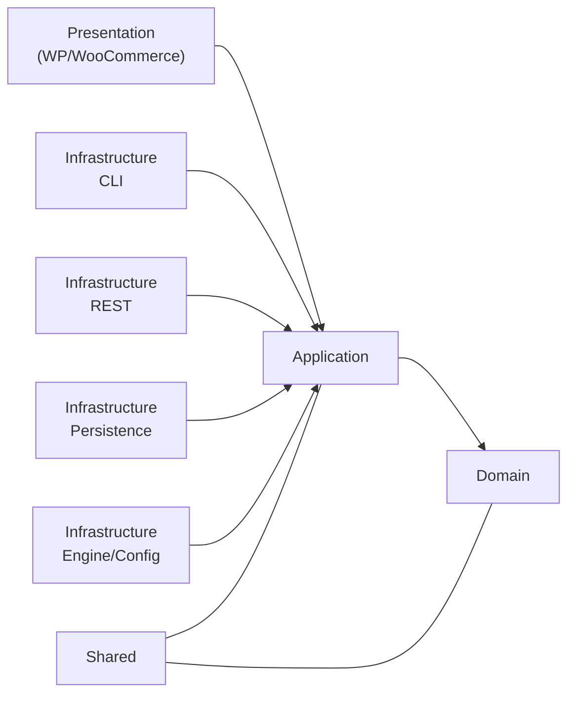
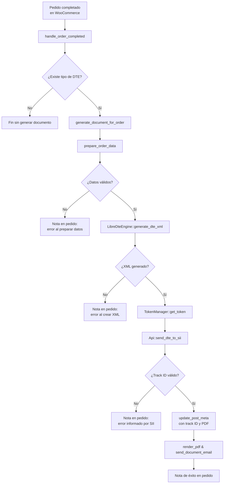
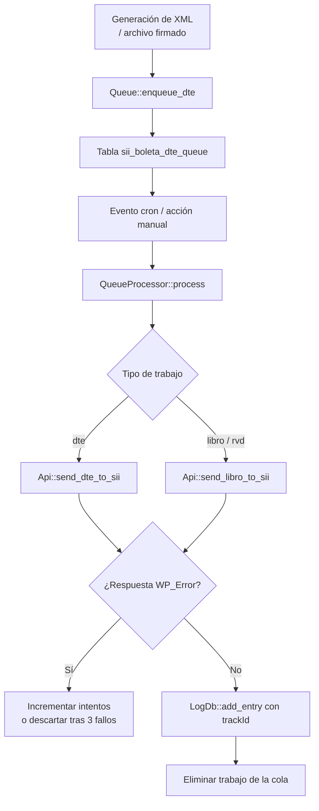

# SII Boleta DTE – Plugin WordPress para emisión de DTE

Plugin modular para generar boletas, facturas y otros Documentos Tributarios Electrónicos (DTE) integrados con el Servicio de Impuestos Internos (SII) de Chile. El núcleo abstrae la firma digital, el uso de CAF, la generación de PDF417 y el intercambio con los servicios del SII para que la interfaz de WordPress y WooCommerce sólo deban orquestar los flujos de negocio.

## Características principales

- **Integración completa con el SII**: genera tokens, firma los XML con `xmlseclibs` y envía DTE, libros y Resumen de Ventas Diarias (RVD) utilizando la librería `libredte-lib-core` como motor de renderizado.【F:sii-boleta-dte/src/Infrastructure/Rest/Api.php†L16-L142】【F:sii-boleta-dte/src/Infrastructure/Engine/LibreDteEngine.php†L13-L129】
- **Gestión de folios y CAF**: administra folios en base de datos, soporta múltiples CAF por tipo de documento y expone un panel para cargar o reemplazar archivos XML autorizados.【F:sii-boleta-dte/src/Application/FolioManager.php†L13-L145】【F:sii-boleta-dte/src/Presentation/Admin/CafPage.php†L17-L214】
- **Cola persistente de trabajos**: almacena envíos pendientes de DTE, libros o RVD en la tabla `sii_boleta_dte_queue` y permite procesarlos manualmente o mediante el evento cron `sii_boleta_dte_process_queue`.【F:sii-boleta-dte/src/Infrastructure/Persistence/QueueDb.php†L7-L160】【F:sii-boleta-dte/src/Application/QueueProcessor.php†L14-L157】
- **Integración con WooCommerce**: añade campos en el checkout, genera el DTE al completar el pedido y expone un repositorio para consultar documentos asociados a órdenes.【F:sii-boleta-dte/src/Presentation/WooCommerce/CheckoutFields.php†L18-L158】【F:sii-boleta-dte/src/Infrastructure/WooCommerce/WooCommerceDteRepository.php†L12-L122】
- **Panel administrativo completo**: páginas para configuración, panel de control, generación manual, diagnóstico, ayuda, logs y manejo de CAF, todas registradas desde `Infrastructure\Plugin` y `Presentation\Admin`.【F:sii-boleta-dte/src/Infrastructure/Plugin.php†L20-L113】【F:sii-boleta-dte/src/Presentation/Admin/Pages.php†L17-L209】
- **Consulta pública de boletas**: expone la ruta `/boleta/{folio}` que renderiza la representación HTML del DTE almacenado en la carpeta de cargas de WordPress.【F:sii-boleta-dte/src/Infrastructure/Rest/Endpoints.php†L11-L92】

## Arquitectura

La base del plugin sigue una arquitectura **hexagonal** (ports & adapters). El código de negocio se concentra en los módulos `Domain` y `Application`, mientras que los adaptadores concretos viven en `Infrastructure` y `Presentation`.



El contenedor de dependencias `Infrastructure\Factory\Container` inicializa los servicios clave (ajustes, motor de timbraje, API del SII, gestor de colas, generador PDF, etc.) y los inyecta en las distintas páginas y casos de uso.【F:sii-boleta-dte/src/Infrastructure/Factory/Container.php†L17-L115】

## Flujos de generación de DTE

### Generación automática desde WooCommerce

Cuando un pedido pasa a estado **Completado**, la integración con WooCommerce obtiene el tipo de documento configurado para la orden y ejecuta `generate_document_for_order()`. El método prepara la carga útil del DTE, genera el XML con el motor LibreDTE, solicita un token y envía el archivo al SII. Al recibir un `trackId`, guarda metadatos en el pedido, renderiza el PDF y notifica al cliente mediante correo electrónico.【F:sii-boleta-dte/src/Infrastructure/WooCommerce/Woo.php†L21-L213】【F:sii-boleta-dte/src/Infrastructure/Engine/LibreDteEngine.php†L89-L206】【F:sii-boleta-dte/src/Infrastructure/Rest/Api.php†L22-L60】



### Envío diferido mediante la cola interna

Los casos de uso pueden persistir un archivo XML firmado en la tabla `sii_boleta_dte_queue` para reenviarlo posteriormente. `Queue::enqueue_dte()` registra el trabajo con el token y ambiente, mientras que `QueueProcessor::process()` lee los pendientes, intenta el envío y registra el resultado o reintenta hasta tres veces antes de descartarlo.【F:sii-boleta-dte/src/Application/Queue.php†L7-L52】【F:sii-boleta-dte/src/Application/QueueProcessor.php†L10-L74】【F:sii-boleta-dte/src/Infrastructure/Rest/Api.php†L22-L138】



## Extender el motor LibreDTE

`LibreDteEngine` actúa como orquestador: delega la preparación de la carga útil a un `DocumentPreparationPipelineInterface`, resuelve CAF y certificados mediante colaboradores inyectables y aplica un `TotalsAdjusterInterface` obtenido desde la fábrica asociada al tipo de documento.【F:sii-boleta-dte/src/Infrastructure/Engine/LibreDteEngine.php†L13-L218】【F:sii-boleta-dte/src/Infrastructure/Engine/Preparation/FactoryBackedDocumentPreparationPipeline.php†L11-L122】【F:sii-boleta-dte/src/Infrastructure/Engine/Factory/DteDocumentFactory.php†L7-L23】

Cada implementación de `DteDocumentFactory` registra su `TemplateLoaderInterface`, `DetailNormalizerInterface`, `ReceptorSanitizerInterface`, `EmisorDataBuilderInterface` y el `TotalsAdjusterInterface` que corresponda al tipo de DTE. Basta con crear la clase y registrarla mediante `register_document_factory()` o inyectar un `DteDocumentFactoryRegistry` personalizado en el constructor del motor.【F:sii-boleta-dte/src/Infrastructure/Engine/Factory/BoletaDteDocumentFactory.php†L19-L60】【F:sii-boleta-dte/src/Infrastructure/Plugin.php†L58-L91】

Los integradores que necesiten sustituir el flujo completo pueden engancharse al filtro `sii_boleta_dte_engine`, construir su propia instancia de `LibreDteEngine` (o un motor alternativo) y proporcionar implementaciones para `DocumentPreparationPipelineInterface`, `CafProviderInterface`, `CertificateProviderInterface` o `XmlPlaceholderCleaner` sin modificar el núcleo.【F:sii-boleta-dte/src/Infrastructure/Engine/LibreDteEngine.php†L33-L120】【F:sii-boleta-dte/src/Infrastructure/Plugin.php†L58-L93】

## Estructura del repositorio

- `sii-boleta-dte/`
  - `sii-boleta-dte.php` – archivo principal del plugin que declara hooks de activación, carga el autoloader de Composer y construye la capa de infraestructura.【F:sii-boleta-dte/sii-boleta-dte.php†L1-L118】
  - `src/Domain/` – entidades y contratos de dominio (`Dte`, `Rut`, `DteRepository`, `Logger`, `DteEngine`).
  - `src/Application/` – casos de uso (`Queue`, `QueueProcessor`, `FolioManager`, `LibroBoletas`, `RvdManager`) que coordinan el dominio y la infraestructura.【F:sii-boleta-dte/src/Application/Queue.php†L9-L91】【F:sii-boleta-dte/src/Application/RvdManager.php†L5-L56】
  - `src/Infrastructure/` – adaptadores concretos: API REST del SII, motor LibreDTE, gestores de folios/logs/colas, integración con WooCommerce, cron, render HTML, PDF y CLI.【F:sii-boleta-dte/src/Infrastructure/Rest/Api.php†L16-L142】【F:sii-boleta-dte/src/Infrastructure/Persistence/FoliosDb.php†L9-L162】
  - `src/Presentation/` – interfaz de administración y componentes de WooCommerce (campos, activos, AJAX y páginas de WP).【F:sii-boleta-dte/src/Presentation/Admin/GenerateDtePage.php†L17-L268】
  - `resources/` – plantillas Twig, archivos YAML y esquemas XML utilizados por LibreDTE y validaciones del SII.
  - `languages/` – traducciones (`.po/.mo`) del dominio `sii-boleta-dte`.
  - `tests/` – pruebas automatizadas con PHPUnit para cada capa, más `fixtures` y resultados esperados.
- `build.sh` / `build.ps1` / `build.bat` – scripts para empaquetar el plugin en un ZIP instalable.

## Construcción del plugin

```bash
chmod +x build.sh
./build.sh
```

El script resuelve la versión desde la cabecera del plugin, ejecuta `composer install --no-dev --prefer-dist --optimize-autoloader` y genera `dist/sii-boleta-dte-<versión>.zip` listo para instalar en WordPress.【F:build.sh†L1-L41】

En Windows PowerShell:

```powershell
Set-ExecutionPolicy -Scope Process RemoteSigned
./build.ps1
```

## Entorno de desarrollo

- Requiere PHP 8.4 con extensiones `soap`, `mbstring`, `openssl` y Composer instalado.【F:sii-boleta-dte/composer.json†L12-L31】
- Instala dependencias y activa el autoloader con:

```bash
cd sii-boleta-dte
composer install
```

- Ejecuta la suite de pruebas y el estándar de código de WordPress/WPCS:

```bash
composer test
composer phpcs
```

Los tests se inicializan desde `tests/bootstrap.php`, que prepara constantes de WordPress y carga mocks mínimos.【F:sii-boleta-dte/tests/bootstrap.php†L1-L112】

## Páginas y flujo en WordPress

El plugin registra sus páginas administrativas en el menú **SII Boletas** y reutiliza las APIs de ajustes y listas de WordPress:

- **Ajustes** – define datos del emisor, certificado, ambiente, tipos de DTE habilitados, opciones PDF, perfil SMTP y logging.【F:sii-boleta-dte/src/Presentation/Admin/SettingsPage.php†L17-L175】
- **Folios / CAFs** – permite subir, listar y eliminar archivos CAF autorizados por el SII, guardándolos en `wp-content/uploads/sii-boleta-dte/cafs/`.【F:sii-boleta-dte/src/Presentation/Admin/CafPage.php†L37-L214】
- **Panel de control** – muestra métricas del plugin (folios disponibles, últimos DTE enviados, estado de la cola) y ofrece acciones de procesar, reintentar o cancelar trabajos pendientes.【F:sii-boleta-dte/src/Presentation/Admin/ControlPanelPage.php†L28-L235】
- **Generación manual** – formulario para emitir DTE sin pedido de WooCommerce, con previsualización PDF/Twig antes del envío al SII.【F:sii-boleta-dte/src/Presentation/Admin/GenerateDtePage.php†L37-L268】
- **Logs** – visor sobre la tabla `sii_boleta_dte_logs` para filtrar entradas por nivel o `trackId`.【F:sii-boleta-dte/src/Presentation/Admin/LogsPage.php†L17-L230】
- **Diagnóstico** – ejecuta validaciones de entorno y pruebas de token contra el SII utilizando la API interna y el gestor de tokens.【F:sii-boleta-dte/src/Presentation/Admin/DiagnosticsPage.php†L19-L220】
- **Ayuda** – recopila enlaces y documentación contextual del plugin.【F:sii-boleta-dte/src/Presentation/Admin/Help.php†L17-L108】

Los scripts y estilos de estas páginas residen en `src/Presentation/assets` y se encolan desde `Pages::enqueue_assets()` únicamente en los hooks apropiados.【F:sii-boleta-dte/src/Presentation/Admin/Pages.php†L89-L210】

## Cron, cola y registros

- El evento `sii_boleta_dte_process_queue` se programa en la activación del plugin y procesa la cola mediante `QueueProcessor::process()`. También ejecuta trabajos de RVD y libros electrónicos programados por `Cron` y `RvdManager`.【F:sii-boleta-dte/src/Infrastructure/Cron.php†L7-L66】【F:sii-boleta-dte/src/Application/RvdManager.php†L16-L38】
- Los logs se almacenan en la tabla `sii_boleta_dte_logs` y, opcionalmente, en archivos dentro de `wp-content/uploads/sii-boleta-logs/`. El `SharedLogger` respeta las preferencias definidas en ajustes y expone un helper global `sii_boleta_write_log()` para reutilizar en temas o plugins externos.【F:sii-boleta-dte/src/Shared/SharedLogger.php†L14-L156】【F:sii-boleta-dte/sii-boleta-dte.php†L82-L118】
- Las migraciones de ajustes, folios manuales y logs desde versiones anteriores se ejecutan en la activación mediante `SettingsMigration`, `FoliosDb::install()` y `LogDb::install()`.【F:sii-boleta-dte/src/Infrastructure/Persistence/SettingsMigration.php†L12-L122】【F:sii-boleta-dte/sii-boleta-dte.php†L64-L79】

## Integración con WooCommerce y checkout

El módulo `Presentation\WooCommerce\CheckoutFields` añade un campo de RUT y selector de tipo de documento en el checkout, valida su formato y almacena los valores como metadatos del pedido. Al marcar un pedido como completado, `Infrastructure\WooCommerce\Woo` genera el DTE correspondiente, lo envía al SII y guarda el XML/PDF en la carpeta de cargas organizada por fecha y RUT.【F:sii-boleta-dte/src/Presentation/WooCommerce/CheckoutFields.php†L26-L158】【F:sii-boleta-dte/src/Infrastructure/WooCommerce/Woo.php†L18-L235】

## Endpoints y CLI

- `Infrastructure\Rest\Endpoints` expone la consulta pública de boletas mencionada anteriormente y puede extenderse para servir PDFs u otros formatos.
- Existe un stub de comando WP-CLI en `Infrastructure\Cli\Cli` (`wp sii-boleta dte_emitir`) listo para ampliarse con automatizaciones o integraciones externas.【F:sii-boleta-dte/src/Infrastructure/Cli/Cli.php†L1-L9】

## Contribuciones

1. Haz fork del repositorio y crea una rama descriptiva.
2. Ejecuta `composer test` y `composer phpcs` antes de enviar el pull request.
3. Describe claramente el objetivo de tu contribución en el mensaje del PR.

## Licencia

El código se distribuye bajo la licencia GPL v2 o posterior. Consulta los encabezados de cada archivo para más detalles.
